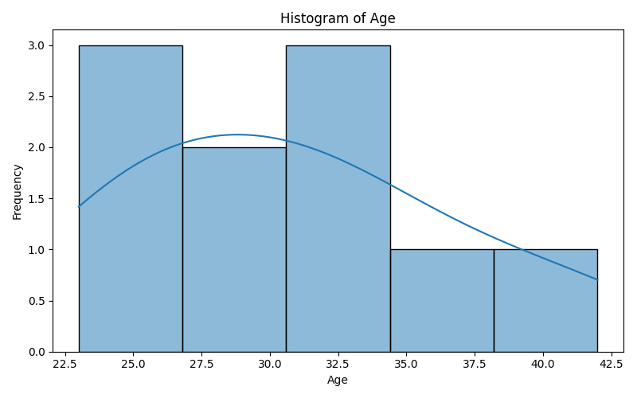

 Data Explorer

A Python command-line tool for exploring and visualizing data from CSV and Excel files. This tool automatically generates data summaries and visualizations to help you quickly understand your datasets.

 

 Features

- 📊 Load data from CSV and Excel files (.csv, .xlsx, .xls)
- 📈 Automatic data summarization (info, statistics, value counts)
- 📉 Generate histograms for numerical columns
- 📊 Generate bar plots for categorical columns
- 💾 Save plots to a specified directory
- 🎯 Simple command-line interface

 Requirements

- Python 3.7+
- pandas
- matplotlib
- seaborn
- openpyxl (for Excel support)

 Installation

1. Clone or download this repository
2. Create a virtual environment (recommended):
   ```bash
   python -m venv .venv
   ```
3. Activate the virtual environment:
   - Windows: `.venv\Scripts\activate`
   - Mac/Linux: `source .venv/bin/activate`
4. Install dependencies:
   ```bash
   pip install pandas matplotlib seaborn openpyxl
   ```

 Usage

 Basic Usage

To explore a CSV or Excel file:

```bash
python data_explorer.py path/to/your/file.csv
```

 Command-Line Options

```
usage: data_explorer.py [-h] [--no-plots] [--plot-dir PLOT_DIR] file_path

positional arguments:
  file_path            Path to the CSV or Excel file

optional arguments:
  -h, --help           Show help message and exit
  --no-plots           Do not generate plots
  --plot-dir PLOT_DIR  Directory to save generated plots (default: 'plots')
```

 Examples

1. Analyze a CSV file with default settings:
   ```bash
   python data_explorer.py sample_data.csv
   ```

2. Analyze without generating plots:
   ```bash
   python data_explorer.py sample_data.csv --no-plots
   ```

3. Save plots to a custom directory:
   ```bash
   python data_explorer.py sample_data.csv --plot-dir my_plots
   ```

4. Analyze an Excel file:
   ```bash
   python data_explorer.py data.xlsx
   ```

 Output

The tool provides three types of output:

 1. DataFrame Information
- Column names and types
- Non-null counts
- Memory usage

 2. Statistical Summary
- For numerical columns: count, mean, std, min, quartiles, max
- For categorical columns: value counts for each unique value

 3. Visualizations (saved to plots/ directory)
- Histograms for numerical columns (with KDE overlay)
- Bar plots for categorical columns showing value distributions

 Sample Data

A sample CSV file (`sample_data.csv`) is included with the following structure:
- Name (categorical)
- Age (numerical)
- Location (categorical)
- Salary (numerical)
- Department (categorical)

 Project Structure

```
DataExplorer.py/
├── data_explorer.py       Main script
├── sample_data.csv        Sample dataset
├── plots/                 Generated visualizations
│   ├── Age_histogram.png
│   ├── Salary_histogram.png
│   ├── Name_bar_plot.png
│   ├── Location_bar_plot.png
│   └── Department_bar_plot.png
└── README.md              This file
```

 How It Works

1. Load Data: Automatically detects file type and loads CSV or Excel files
2. Summarize: Displays DataFrame info, statistical summary, and value counts
3. Visualize: Creates and saves plots for all numerical and categorical columns
4. Save: Stores all visualizations in the specified output directory

 Error Handling

The tool handles common errors gracefully:
- File not found
- Unsupported file types
- Invalid data formats
- Empty datasets

 Contributing

Feel free to submit issues, fork the repository, and create pull requests for any improvements.

 License

This project is open source and available under the MIT License.

 Author

Created as a simple yet powerful data exploration tool for data scientists and analysts.

---

Happy Data Exploring! 📊
